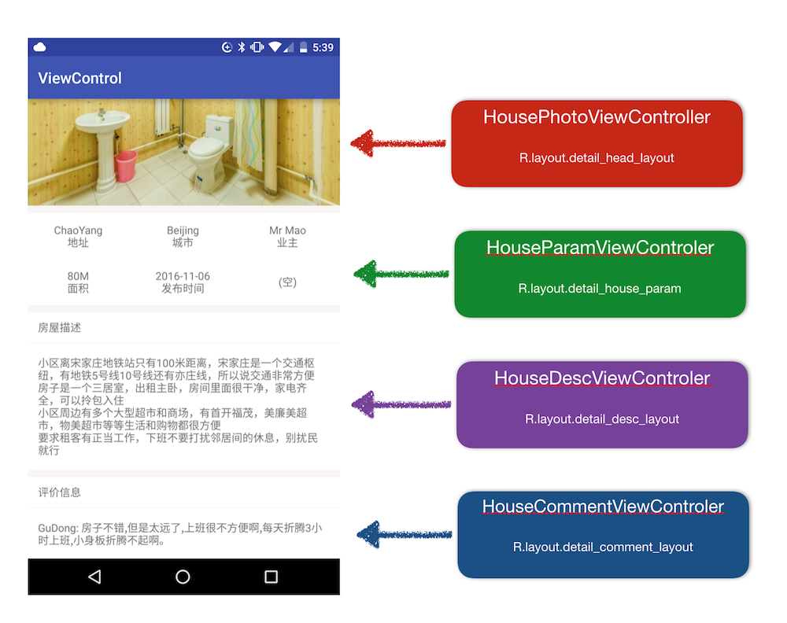

# ViewControler
ViewControler 是一种界面开发组件化实现方式,利用它可以将一些复杂的 UI 界面开发组件化,
从而更好的组织代码结构,从而提高开发效率,降低维护成本。

关于 ViewControler 这种思想的介绍,也可以查看我之前写的一篇文章,[Android 复杂界面开发实践之 ViewController: 前言](http://gudong.name/2016/10/13/viewcontroller-foreword.html)

## 使用方法 

目前已经使用 ViewControler 完成了一个房屋详情页开发 demo ,你可以直接运行代码,查看 demo 如何运行,下面是一般的使用流程。

### 1、根据业务需求,划分 UI 组件

如下所示是一个示例的 UI 开发场景,这是一个房屋详情页面,


按照一般的开发方式,我们需要在 layout 中先写好所有的布局,然后在对应的 Activity 中
实例化所有的 View 示例,然后请求数据后,把数据分别填充在不同的 View 上,最终完成这个界面的开发。

但是现在,我们利用 ViewControler 后,可以把这儿界面组件化,显然我们可以把它分为四个 UI 组件。

* 顶部的房屋图片组件
* 房屋信息组件
* 价格组件
* 评论组件

至于怎么划分组件,完全取决于具体的 UI 情景,这里只是以一个房屋详情页进行举例。

### 实现组件

只要划分完组件后,接下来就是分别实现组件的过程,这里以评论组件位例进行介绍,这里命名为 HouseCommentViewControler。

所有的组件都可以通过继承 ViewControler 实现, ViewControler 是一个抽象类,你只需要实现下面三个抽象方法即可。

* resLayoutId()
* onCreatedView(View view)
* onBindView(T data)

#### resLayoutId
该方法指定该 ViewControler 对应的 layout ID。所以这里需要去根据具体的 UI 样式去创建一个评论组件的 layout,然后在这里返回对应的 layout id。 

#### onCreatedView(View view)
该方法是用于初始化 View 的一个方法,你可以在这里实例化对应组件内的所有 View,也可以在
这里对 View 做一些事件监听等等。

#### onBindView(T data)
这个方法是最终进行数据绑定的地方。

ViewControler 是一个泛型类,这里的 T 是这个 ViewControler 对应的数据类型。对于评论组件,只是展示一列不同用户的评价信息,
使用简单的字符串集合即可,所以这里的 T 应该是 List<String>.

#### 示例

下面是 HouseCommentViewControler 的实现方式

```java
//继承 ViewControler
public class HouseCommentViewControler extends ViewControler<List<String>> 

//指定 layout id 
@Override
protected int resLayoutId() {
    return R.layout.detail_comment_layout;
}

// View 初始化
@Override
protected void onCreatedView(View view) {
    ButterKnife.bind(this,view);
}

// 绑定数据到 view
@Override
protected void onBindView(List<String> comments) {
    for (String comment:comments) {
        TextView view = new TextView(getContext());
        view.setBackgroundResource(R.color.bk_item);
        view.setText(comment);
        int padding = Utils.dp2px(16);
        view.setPadding(padding,padding,padding,padding);
        mLlContainer.addView(view);
    }
}
```

具体实现可查看对应 demo 中 HouseCommentViewControler 的[实现源码](https://github.com/maoruibin/ViewControler/blob/master/app/src/main/java/name/gudong/demo/view/HouseCommentViewControler.java)

至此,评论组件的实现类 HouseCommentViewControler 已经开发完毕,剩下的其他组件开发方式都一样。

下面是不同组件对应的实现类。
 
 * 顶部的房屋图片组件 -> HousePhotoViewController
 * 房屋信息组件 -> HouseParamViewControler
 * 房屋描述组件 -> HouseDescViewControler
 * 评论组件 -> HouseCommentViewControler
 

### 在 Activity 中应用实现的组件灵活配置界面

开发完成组件后,剩下的事就是在 Activity 中去组合这几个组件了,
这里通过 Activity 中的一个容器 View 与组件关联,所以这里需要在 Activity 中定义
一个容器 View,一般可以选择一个垂直的 LinearLayout。

接下来首先需要实例化组件,接着将组件与 Activity 关联,然后在合适的时机向组件填充数据,如下所示。
 
```java
//定义组件实例
private ViewControler<List<String>> mHousePhotoViewController;
private ViewControler<HouseDetail.Param> mHouseParamViewControler;
private ViewControler<List<String>> mHouseCommentViewControler;
private ViewControler<String> mHouseDescViewControler;

//实例化组件
mHousePhotoViewController = new HousePhotoViewController(this);
mHouseParamViewControler = new HouseParamViewControler(this);
mHouseDescViewControler = new HouseDescViewControler(this);
mHouseCommentViewControler = new HouseCommentViewControler(this);

//模拟数据获取操作
getData();

//数据获取成功后向组件填充数据
private void fillData(HouseDetail detail) {
    mHousePhotoViewController.fillData(detail.photos);
    mHouseParamViewControler.fillData(detail.param);
    mHouseDescViewControler.fillData(detail.desc);
    mHouseCommentViewControler.fillData(detail.comments);
}
```

最终的实现结果如下



### 总结 

至此, 界面开发完成。你会发现主界面中看不到任何具体 View 操作相关的代码,
因为这些代码都已经被分发到不同的 ViewController 中去了。这样在后期的维护开发过程中,你不需要去 Activity 中做什么修改,只需要找到指定的 ViewControler
,然后操作这些 ViewControler 即可。极大的解决了 Activity 中 UI 逻辑代码复杂的问题,组件化后,后续的维护开发就会变得特别有条理。

如果有任何问题,欢迎 issue.

## Author

[Home](http://gudong.name)

[Weibo](http://weibo.com/maoruibin)

[Github](https://github.com/maoruibin)

## License

    Copyright 2016 GuDong
    
    Licensed under the Apache License, Version 2.0 (the "License");
    you may not use this file except in compliance with the License.
    You may obtain a copy of the License at
    
        http://www.apache.org/licenses/LICENSE-2.0
    
    Unless required by applicable law or agreed to in writing, software
    distributed under the License is distributed on an "AS IS" BASIS,
    WITHOUT WARRANTIES OR CONDITIONS OF ANY KIND, either express or implied.
    See the License for the specific language governing permissions and
    limitations under the License.